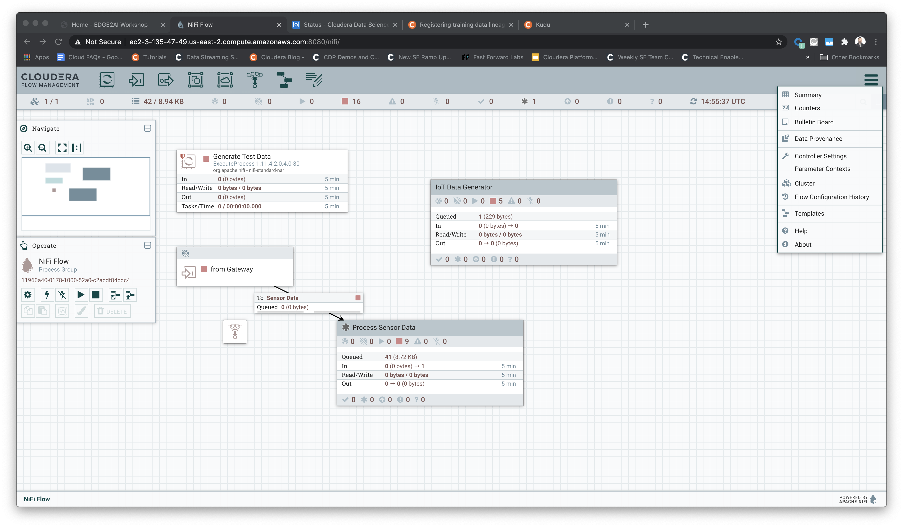
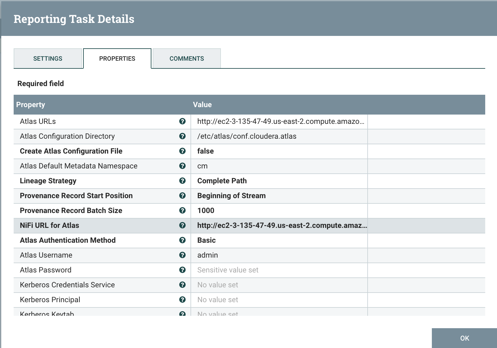
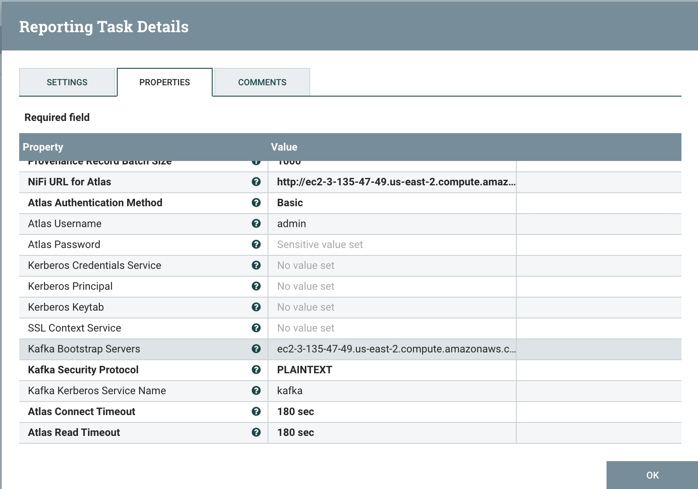

= End to End Governance with ATLAS

In this module we will cover the Governance side of the use case. Some of the components are integrated into Atlas by default. Some others need a bit of tweacking before they report activities to Atlas.

== Labs summary

* *Lab 1* - NiFi integration.
* *Lab 2* - Kafka integration.
* *Lab 3* - CDSW integration.

[[lab_1, Lab 1]]
== Lab 1 - NiFi integration with ATLAS

In this lab you will go back to the NiFi canvas as you will need to configure a controller service for NiFi to report lineage info to Atlas.

=== STEP 1: Edit Atlas application properties
. First, ssh into node (as centos, using procedure in workshop web). Then:
[source]
----
#sudo su -
#vi /etc/atlas/conf.cloudera.atlas/atlas-application.properties
----
. Amend the following property to the end of the file:
[source]
----
atlas.notification.hook.asynchronous=false
----
Leave all other properties unmodified. The file must look like this:
[source]
----
[root@ec2-3-142-181-122 hook-bin]# cat /etc/atlas/conf.cloudera.atlas/atlas-application.properties
atlas.kafka.zookeeper.session.timeout.ms=60000
atlas.kafka.zookeeper.connection.timeout.ms=30000
atlas.kafka.zookeeper.sync.time.ms=20
atlas.kafka.bootstrap.servers=ec2-3-142-181-122.us-east-2.compute.amazonaws.com:9092
atlas.kafka.zookeeper.connect=ec2-3-142-181-122.us-east-2.compute.amazonaws.com:2181/kafka
atlas.kafka.security.protocol=PLAINTEXT
atlas.rest.address=http://ec2-3-142-181-122.us-east-2.compute.amazonaws.com:31000
atlas.metadata.namespace=cm
keystore.type=jks
truststore.type=jks
atlas.kafka.ssl.keystore.type=jks
atlas.kafka.ssl.truststore.type=jks
atlas.notification.hook.asynchronous=false
----

=== STEP 2: Configure Reporting Task

. From the main canvas, on the upper right corner, click the three bars and get to Controller Settings

. In the Reporting Tasks tab add a ReportLineageToAtlas with following settings:
.. The http URL of your Atlas Server (in this case the URL for the OneNodeCluster) ending in the 31000 port
.. The location of the Atlas configuration file, in this workshop, it should be:
+
[source]
----
/etc/atlas/conf.cloudera.atlas
----
+

.. The http URL of the NiFi node (your OneNodeCluster URL ended in :8080/nifi/)
.. The http URL of the kafka broker for Atlas Kafka Service (your OneNodeCluter URL endded in 9092 port)

[[lab_2, Lab 2]]
== Lab 2 - Kafka integration with ATLAS

As of today, March 2021, there is no further integration has yet been released by engineering, meaning, to integrate Kafka you need to use the hook.

=== STEP 1: Run the Kafka hook as root
. First, ssh into node, then:
+
[source]
----
# sudo su -
# cd /opt/cloudera/parcels/CDH/lib/atlas/hook-bin
# ./import-kafka.sh

*note that import-kafka.sh could be in other directory in your setup
----
+
. Fill the kafka hook information requested (Atlas user and password: admin/supersecret1)
+
[source]
----
[root@ec2-3-135-47-49 hook-bin]# ./import-kafka.sh
>>>>> ./import-kafka.sh
>>>>> /opt/cloudera/parcels/CDH-7.1.6-1.cdh7.1.6.p0.9611847/lib/atlas
Using Kafka configuration directory [/etc/kafka/conf]
Log file for import is /var/log/atlas/import-kafka.log
Enter username for atlas :- admin
Enter password for atlas :-
Updating Kafka topic iot_enriched
Updating Kafka topic connect-configs
Updating Kafka topic __smm-app-smm-producer-table-30s-repartition
Updating Kafka topic __smm-app-smm-producer-table-15m-changelog
Updating Kafka topic __smm_producer_metrics
Updating Kafka topic ATLAS_SPARK_HOOK
Updating Kafka topic connect-offsets
Updating Kafka topic __smm-app-smm-producer-table-15m-repartition
Updating Kafka topic __smm-app-smm-consumer-table-15m-repartition
Updating Kafka topic __smm-app-smm-consumer-table-30s-repartition
Updating Kafka topic iot
Updating Kafka topic __smm_consumer_metrics
Updating Kafka topic ATLAS_HOOK
Updating Kafka topic __KafkaCruiseControlPartitionMetricSamples
Updating Kafka topic __smm_alert_notifications
Updating Kafka topic __smm-app-smm-consumer-table-15m-changelog
Updating Kafka topic __KafkaCruiseControlModelTrainingSamples
Updating Kafka topic connect-status
Updating Kafka topic __smm-app-smm-producer-table-30s-changelog
Updating Kafka topic ATLAS_ENTITIES
Updating Kafka topic __smm-app-producer-metrics-keys-index-changelog
Updating Kafka topic __smm-app-smm-consumer-table-30s-changelog
Updating Kafka topic __smm-app-consumer-metrics-keys-index-changelog
Kafka Data Model imported successfully!!!
----

=== STEP 2:

. From the main page of your project, select the *Models* button. Select *New Model* and specify the following configuration:
+
[source, python]
----
Name:          IoT Prediction Model
Description:   IoT Prediction Model
File:          cdsw.iot_model.py
Function:      predict
Example Input: {"feature": "0, 65, 0, 137, 21.95, 83, 19.42, 111, 9.4, 6, 3.43, 4"}
Kernel:        Python 3
Engine:        2 vCPU / 4 GB Memory
Replicas:      1
----
+
image:images/create_model.png[width=800]

. After all parameters are set, click on the *Deploy Model* button. Wait till the model is deployed. This can take several minutes.

=== STEP 3: Test the deployed model

. When your model status change to `Deployed`, click on the model name link to go to the Model's *Overview* page. From the that page, click on the *Test* button to check if the model is working.

. The green circle with the `success` status indicates that our REST call to the model is working. The `1` in the response `{"result": 1}`, means that the machine from where these temperature readings were collected is _unlikely_ to experience a failure.
+
image::images/test_model.png[width=800]

. Now, lets change the input parameters and call the predict function again. Put the following values in the Input field:
+
[source,python]
----
{
  "feature": "0, 95, 0, 88, 26.62, 75, 21.05, 115, 8.65, 5, 3.32, 3"
}
----

. With these input parameters, the model returns `0`, which means that the machine is likely to break.

